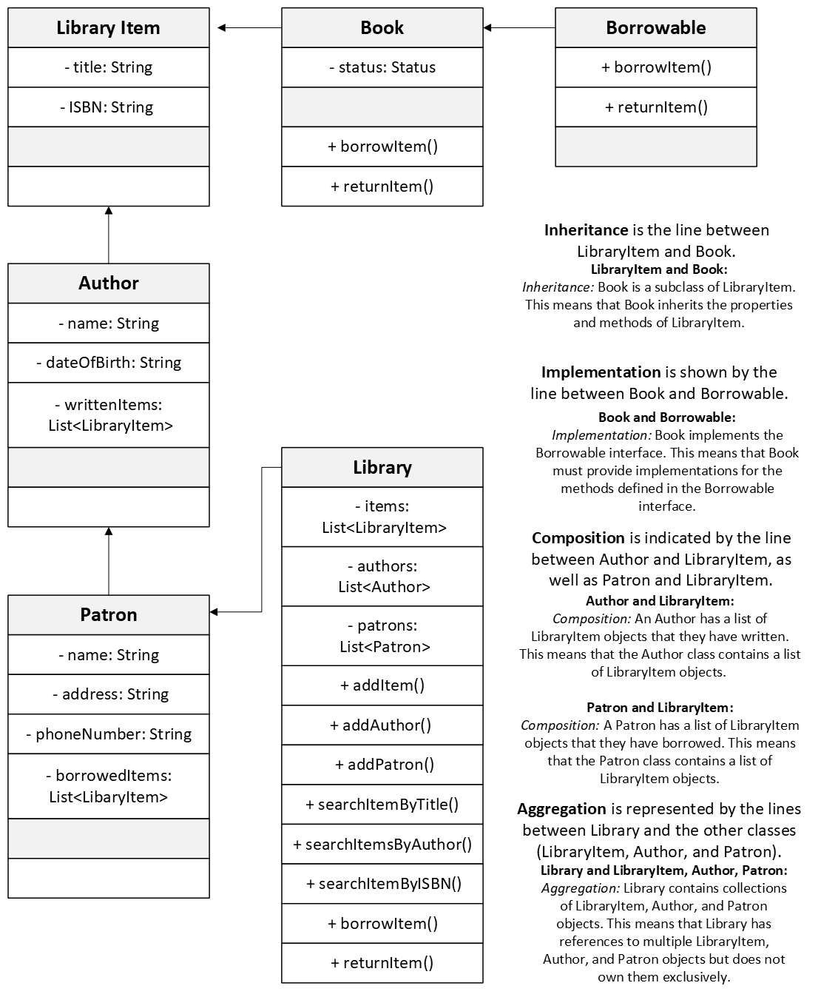

# Library Management System

## Overview
This application manages a library of books, authors, and patrons. It allows patrons to borrow and return books.

## Classes and Their Functions
1. **LibraryItem**: An abstract class representing a library item.
2. **Book**: A class representing a book, implements the `Borrowable` interface.
3. **Author**: Represents an author with a name, date of birth, and a list of written items.
4. **Patron**: Represents a library patron with personal details and a list of borrowed items.
5. **Library**: Manages library items, authors, and patrons. Provides methods to search, borrow, and return items.
6. **Demo**: Main class to showcase the library system.
7. **Borrowable**: An interface defining methods to borrow and return items.
8. **Status**: An enum representing the status of a book.

## Library Management System
1. **Add Book**: Allows the user to add a new book to the library.
2. **Add Author**: Allows the user to add a new author to the library.
3. **Add Patron**: Allows the user to add a new patron to the library.
4. **Borrow Book**: Allows a patron to borrow a book from the library.
5. **Return Book**: Allows a patron to return a borrowed book to the library.
6. **Search Book by Title**: Allows the user to search for a book by its title.
7. **Search Book by Author**: Allows the user to search for books by a specific author.
8. **Search Book by ISBN**: Allows the user to search for a book by its ISBN.
9. **Display All Books**: Displays all the books available in the library.
10. **Display All Authors**: Displays all the authors available in the library.
11. **Display All Patrons**: Displays all the patrons registered in the library.
12. **Display Borrowed Books** by Patron: Displays the list of books borrowed by a specific patron.
0. **Exit**: Exits the library management system.
**Enter your choice**: Enter the corresponding number for the option you wish to initiate.

## How to Run the Application
1. Compile all the Java files.
2. Run the `Demo` class.

## Class Diagram
